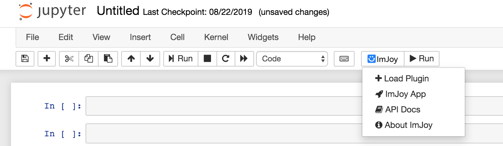

ImJoy Jupyter Extension
============
Try the demo here: [](https://mybinder.org/v2/gh/imjoy-team/imjoy-binder-image/master?filepath=imjoy-jupyter-tutorial.ipynb)


## Using ImJoy with Jupyter Notebook and JupyterLab

This extension utilizes the [imjoy-rpc](https://github.com/imjoy-team/imjoy-rpc) library to enable bidirectional RPC calls between the ImJoy core and plugins.

The library has an abstract transport interface that can support different types of transport. For now, we support [Jupyter comms message](https://jupyter-notebook.readthedocs.io/en/stable/comms.html) which is a custom message protocol used in Jupyter notebooks (for example powers jupyter widgets).

To use it, you need to install the `imjoy-jupyter-extension` in Python which will also include the imjoy-rpc as a dependency (see below).

### Install the extension for Jupyter Notebook or JupyterLab

For Jupyter Notebook, run:

```bash
pip install -U imjoy-jupyter-extension
```

For Jupyter Lab, run:
```bash
pip install -U imjoy-jupyter-extension

jupyter labextension install imjoy-jupyter-extension
```

### Use ImJoy plugins inside Jupyter notebooks
Now you can start a jupyter notebook via for example `jupyter notebook` command, you should be able to see an ImJoy icon in the toolbar if everything goes well.



For JupyterLab, start it via `jupyter lab` command, then create a notebook and you should see an ImJoy button in the toolbar:


Now run ImJoy plugins in a cell, see an example that uses itk-vtk-viewer to visualize images:
```python
import imageio
import numpy as np
from imjoy_rpc import api

class ImJoyPlugin():
    def setup(self):
        api.log('plugin initialized')

    async def run(self, ctx):
        viewer = await api.showDialog(src="https://kitware.github.io/itk-vtk-viewer/app/")

        # show a 3D volume
        image_array = np.random.randint(0, 255, [10,10,10], dtype='uint8')
        
        # show a 2D image
        # image_array = imageio.imread('imageio:chelsea.png')

        await viewer.setImage(image_array)

api.export(ImJoyPlugin())
```

With the above code, you created an ImJoy plugin. To run it, click the Run button with the ImJoy icon. It will then call the run function of your plugin.


 * GIF Demo: [Visualizing 2D image](https://ibb.co/XDFF5bQ)
 * GIF Demo: [Visualizing 3D volume](https://ibb.co/QXR63XM)
 * GIF Demo: [Load ImageAnnotator](https://ibb.co/0Zyfxkr)

You can also do the reverse by running a notebook inside ImJoy, to do that, please first create an empty jupyter notebook. Then copy and paste the url into the "+ PLUGINS" dialog, press enter and install the plugin. Click the newly installed plugin and you will get a notebook page open in ImJoy. 

Try to copy and paste the itk-vtk-viewer example to a cell and execute it. Similarily, if you now click the run ImJoy button in the toolbar, you will get the viewer open insided ImJoy.


### Load plugin dynamically in a notebook

There are different ways to load a plugin in a notebook, you can load from URL for the source code of the plugin (e.g. gist or github file url) or a hosted web app (e.g. the itk-vtk-viewer app used above). Besides that, you can also write a window plugin directly in a notebook. This is practical especially for debugging window plugin for your GUI.

You can directly pass a string with the plugin source code to `api.getPlugin`, `api.createWindow(src=...)` or `api.showDialog(src=...)`, however, that doesn't give you syntax highliting in a Jupyter notebook cell. A workaround solution (which also works for Google Colab) is to write plugin code in a seperate cell startting with `## ImJoy Plugin` and wrap the source code with `IPython.display.HTML()`. For example:
```html
## ImJoy Plugin
from IPython.display import HTML
my_plugin_source = HTML('''
<docs lang="markdown">
[TODO: write documentation for this plugin.]
</docs>

<config lang="json">
{
  "name": "Untitled Plugin",
  "type": "window",
  "tags": [],
  "ui": "",
  "version": "0.1.0",
  "cover": "",
  "description": "[TODO: describe this plugin with one sentence.]",
  "icon": "extension",
  "inputs": null,
  "outputs": null,
  "api_version": "0.1.8",
  "env": "",
  "permissions": [],
  "requirements": [],
  "dependencies": [],
  "defaults": {"w": 20, "h": 10}
}
</config>

<script lang="javascript">
class ImJoyPlugin {
  async setup() {
    api.log('initialized')
  }

  async run(ctx) {

  }
}

api.export(new ImJoyPlugin())
</script>

<window lang="html">
  <div>
    <p>
    Hello World
    </p>
  </div>
</window>

<style lang="css">

</style>
''')
```

Then in another cell, you can passing the plugin source code to `api.getPlugin`, `api.createWindow(src=...)` or `api.showDialog(src=...)` to make an actually plugin:
```python
from imjoy import api
class ImJoyPlugin():
    async def setup(self):
        pass

    async def run(self, ctx):
        # for regular plugin
        # p = await api.getPlugin(my_plugin_source)

        # or for window plugin
        # await api.createWindow(src=my_plugin_source)
        await api.showDialog(src=my_plugin_source)

api.export(ImJoyPlugin())
```

## Development

To develop the JupyterLab extension, open a terminal and run:

```bash
cd imjoy_jupyterlab_extension
npm run watch
```

In another terminal window run:
```
jupyter labextension install ./imjoy_jupyterlab_extension
```